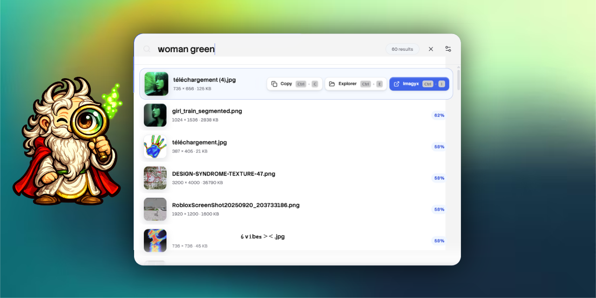

<p align="center">
  
</p>

<h1 align="center">Imagyx</h1>

<p align="center">
  <strong>Find images on your computer with natural language. Local, private, open-source.</strong>
</p>

<p align="center">
  <a href="https://github.com/ExtraBinoss/imagyx/releases"><strong>Download</strong></a>
  ·
  <a href="#how-it-works">How it works</a>
  ·
  <a href="./docs/dev/README.md">Developer setup</a>
</p>

<br />

<p align="center">
  
</p>

## Demo

See how Imagyx lets you search your local image library instantly using natural language.

[IMAGYX-demo (1).webm](https://github.com/user-attachments/assets/cbd375ac-0d6a-4cf8-ab5b-89958bc7bdcd)

<br />

Imagyx lets you search the images already stored on your computer using ordinary words and descriptions. Search for things such as `purple sunset`, `red texture`, `a person near the sea`, or part of a filename—without uploading your library anywhere.

## Download

<p>
  <a href="https://github.com/ExtraBinoss/imagyx/releases"><strong>Download Imagyx from GitHub Releases →</strong></a>
</p>

Windows and macOS builds are published manually on the Releases page. Your images stay where they are; installing Imagyx does not import, move, or duplicate them.

<h2 id="how-it-works">How it works</h2>

<table>
  <thead>
    <tr>
      <th width="33%">1 · Add a folder</th>
      <th width="33%">2 · Let Imagyx index it</th>
      <th width="33%">3 · Search naturally</th>
    </tr>
  </thead>
  <tbody>
    <tr>
      <td>
        Choose any folder that contains images. Imagyx discovers the files and automatically prepares the local search components it needs.
      </td>
      <td>
        Wait for the first indexing pass to finish. Progress stays visible while image metadata and the private semantic index are created.
      </td>
      <td>
        Search from the app or open Spotlight with <kbd>Ctrl</kbd> + <kbd>9</kbd> on the numeric keypad by default.
      </td>
    </tr>
  </tbody>
</table>

After the first setup, the search engine and index live locally on your computer. New and changed images are detected automatically inside followed folders.

## Search without opening the full app

Use the global Spotlight shortcut:

<p align="center">
  <kbd>Ctrl</kbd> + <kbd>9</kbd>
  <br />
  <sub>Numeric keypad by default. The shortcut can be changed in Imagyx settings.</sub>
</p>

Type a description, move through results with the arrow keys, then open, copy, or reveal an image directly from the overlay.

## Built around your privacy

<table>
  <tr>
    <td width="33%" align="center">
      <strong>Local</strong><br />
      Search and indexing run on your computer.
    </td>
    <td width="33%" align="center">
      <strong>Private</strong><br />
      Your images are not uploaded to a search service.
    </td>
    <td width="33%" align="center">
      <strong>Non-destructive</strong><br />
      Original files are never renamed, moved, or modified.
    </td>
  </tr>
</table>

The first setup may download the files required by the local search model. Once cached, normal searching works against the local index.

## Lightweight in the background

Imagyx is designed to remain unobtrusive when it is waiting in the background, with an idle memory footprint of approximately **40 MB** in typical use. Indexing and the first model warm-up temporarily use more CPU and memory while work is actively being performed.

Generated data is kept separately from your originals:

```text
Pictures/imagyx/
├── models/
├── database/imagyx.sqlite3
├── cache/thumbnails/
└── logs/
```

## Features

- natural-language and filename search;
- fast Spotlight-style global search;
- automatic recursive folder watching;
- local semantic indexing;
- progressive results while semantic search finishes;
- on-demand cached thumbnails;
- keyboard-first navigation and quick actions;
- light and dark appearance;
- Windows and macOS desktop support;
- multilingual interface: English, Français, Español, Deutsch, Italiano, Português, 日本語, 简体中文, العربية, Русский.

## Contributing

Issues, ideas, bug reports, and pull requests are welcome. Development setup is documented separately for each supported platform:

- [Windows development guide](./docs/dev/windows.md)
- [macOS development guide](./docs/dev/mac.md)
- [Developer documentation index](./docs/dev/README.md)

<details>
  <summary><strong>Developer information</strong></summary>

  <br />

  ### Quick start

  Requirements:

  - Node.js 22.12 or newer;
  - Rust 1.88 or newer;
  - the native build dependencies documented in the platform guides.

  ```bash
  npm install
  npm run tauri dev
  ```

  ### Local validation

  ```bash
  npm run typecheck
  npm test
  npm run build
  cargo fmt --manifest-path src-tauri/Cargo.toml --all -- --check
  cargo check --manifest-path src-tauri/Cargo.toml
  cargo test --manifest-path src-tauri/Cargo.toml
  cargo clippy --manifest-path src-tauri/Cargo.toml --all-targets
  ```

  ### Implementation overview

  The desktop shell is built with Tauri and Rust. The interface uses Vue and TypeScript. Metadata, text search, and persisted vectors are stored locally with SQLite. Semantic search uses MobileCLIP-S0 through Transformers.js, with WebGPU acceleration when available and a WASM fallback.

  The Rust backend is divided by responsibility under `src-tauri/src/`, including commands, database access, indexing, fuzzy search, tracing, and the in-memory vector store.

  Release workflows and release publication are intentionally manual. Build artifacts can be produced with:

  ```bash
  npm run tauri build
  ```

  Additional performance and backend notes are available in [docs/RUST_PERFORMANCE_PLAN.md](./docs/RUST_PERFORMANCE_PLAN.md).

</details>
